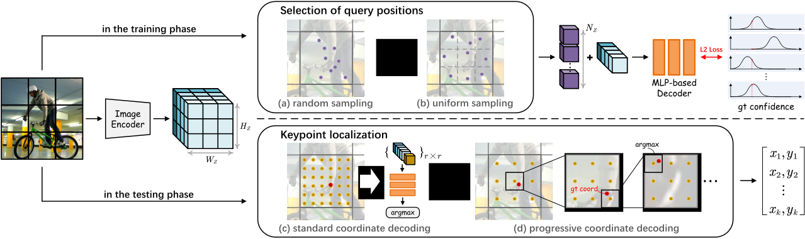

# [NeurIPS'24] Continuous Heatmap Regression for Pose Estimation via Implicit Neural Representation

By introducing implicit neural representation (INR), the proposed NerPE achieves continuous heatmap regression for 2D human pose estimation. Thanks to the decoupling of INR and spatial resolution, NerPE can output the predicted heatmaps at arbitrary resolutions.


## Installation & Preparation
Experiment Environment:
- python 3.12
- pytorch 2.3
- torchvision 0.18

The details of dependency installation and data preparation are given [here](https://github.com/leoxiaobin/deep-high-resolution-net.pytorch/). Please replace the values ​​of DATASET.ROOT, MODEL.PRETRAINED, and TEST.COCO_BBOX_FILE in the configuration file with the corresponding paths.


## Training & Testing
**Training on MPII dataset**
```
python tools/train.py \
    --cfg experiments/mpii/hrnet/w32_128x128_feat_8x8_gau_0.06.yaml
```
**Testing on MPII dataset**
```
python tools/test.py \
    --cfg experiments/mpii/hrnet/w32_128x128_feat_8x8_gau_0.06.yaml \
    TEST.MODEL_FILE _PATH_TO_CHECKPOINT_
```
The commands used for COCO and CrowdPose are similar, where the configuration file is changed to the corresponding one and TEST.USE_GT_BBOX is set to false during testing.

**Note:**
- There may be rare problems after the code is sorted out. If this happens, please contact us.
- NerPE-p, which uses progressive coordinate decoding, will be integrated into the project later.


## Acknowledgement
This project is developed based on [HRNet](https://github.com/leoxiaobin/deep-high-resolution-net.pytorch/) and [LIIF](https://github.com/yinboc/liif).
