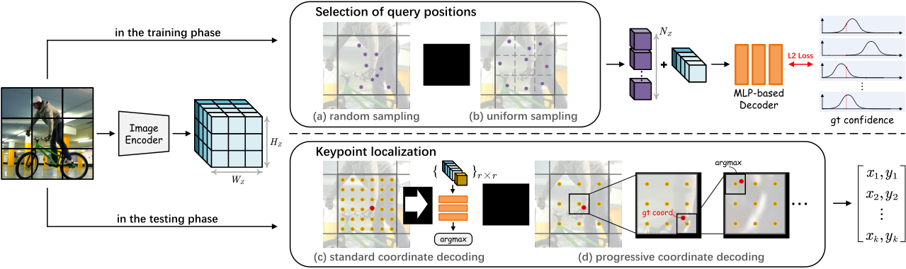

# [NeurIPS'24] Continuous Heatmap Regression for Pose Estimation via Implicit Neural Representation

By introducing implicit neural representation (INR), the proposed NerPE achieves continuous heatmap regression for 2D human pose estimation. Thanks to the decoupling of INR and spatial resolution, NerPE can output the predicted heatmaps at arbitrary resolutions. See Continuous Heatmap Regression for Pose Estimation via Implicit Neural Representation for details.
## Implementation
The code for NerPE is being sorted out and coming soon.

<!--
## Installation & Preparation

Please replace the values ​​of DATASET.ROOT, MODEL.PRETRAINED, and TEST.COCO_BBOX_FILE in the configuration file with the corresponding paths. The details of data preparation, training, and testing are given [here](https://github.com/leoxiaobin/deep-high-resolution-net.pytorch/). 

## Training & Testing

## Citation
-->

<!--

Note
代码可能出现问题，如果发生了请联系我们
后续版本会在后续给出

-->

## Acknowledgement
This project is developed based on [HRNet](https://github.com/leoxiaobin/deep-high-resolution-net.pytorch/) and [LIIF](https://github.com/yinboc/liif).
